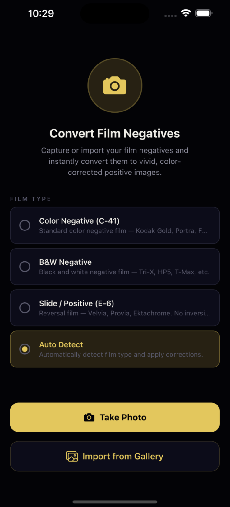
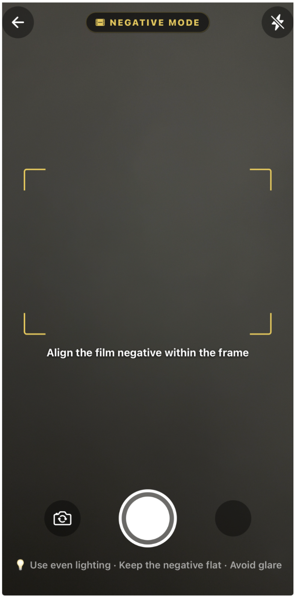
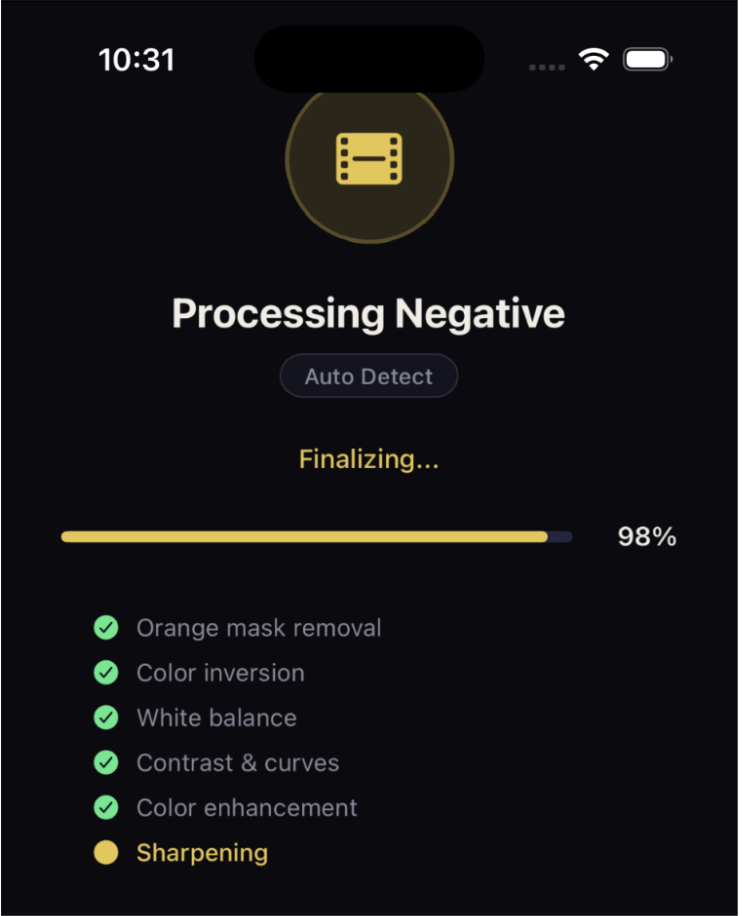
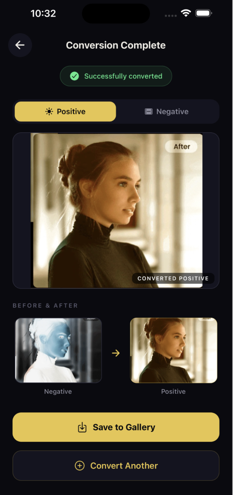

# 🎞️ NEGATIV

**NEGATIV** is an Expo React Native mobile app that converts photographed or imported film negatives into polished positive images directly on-device.

This project was completed in **May 2026** as a final project for **CPE 462-A** at Stevens Institute of Technology.

The app was designed to make film digitization more accessible by allowing users to capture or import a film negative, process it locally, compare the original and converted result, and save the final image back to their phone gallery.

---

## ✨ Highlights

* 📸 Capture a film negative using the phone camera
* 🖼️ Import negatives from the device gallery
* 🎞️ Choose from color negative, black-and-white, slide, or auto-detect modes
* ⚙️ Run a multi-step negative-to-positive conversion pipeline
* 📊 View progress feedback while processing
* 🔍 Compare the original negative with the converted positive image
* 💾 Save the final result back to the device gallery
* 📱 Process images locally on-device without requiring a server

---

## 📸 Screenshots

| Home                                               | Camera                                                 |
| -------------------------------------------------- | ------------------------------------------------------ |
|  |  |

| Processing                                                     | Result                                                 |
| -------------------------------------------------------------- | ------------------------------------------------------ |
|  |  |

---

## 🌟 Overview

Digitizing film negatives usually requires a scanner or desktop editing software. A phone camera can capture a negative, but the image usually appears inverted, tinted, low contrast, and difficult to use directly.

NEGATIV solves this by combining mobile image capture with client-side image processing. The app guides the user through a simple workflow:

1. Select a film type
2. Capture or import a negative image
3. Process the image
4. Compare the negative and positive versions
5. Save the final converted image

The goal was to create a practical mobile workflow for converting film negatives without needing a dedicated scanner or external editing software.

---

## 🛠️ Tech Stack

* Expo SDK 51
* React Native 0.74
* JavaScript
* React Navigation
* Expo Camera
* Expo Image Picker
* Expo Media Library
* Expo File System
* React Native WebView
* HTML5 Canvas

---

## 🧠 Image Processing Pipeline

NEGATIV uses a hidden **React Native WebView** with an **HTML5 Canvas** to perform pixel-level image manipulation inside the mobile app.

The conversion pipeline includes:

1. Reading the captured or imported image as base64 data
2. Loading the image into an HTML5 Canvas
3. Applying orange mask compensation for color negatives
4. Inverting the negative image into a positive image
5. Applying automatic white balance
6. Stretching the histogram to improve tonal range
7. Applying gamma correction
8. Adjusting contrast
9. Increasing saturation
10. Normalizing brightness
11. Applying sharpening
12. Returning the processed image as a JPEG

This approach allowed the app to process images locally on the device while staying cross-platform.

---

## 📱 App Flow

### Home Screen

The home screen lets the user select a film preset and choose whether to take a new photo or import an existing image.

Available film presets include:

* Color Negative
* Black-and-White Negative
* Slide / Positive
* Auto Detect

### Camera Screen

The camera screen provides a live camera view with an alignment guide to help the user center the film negative.

It also includes:

* Flash toggle
* Camera flip button
* Capture button
* Tips for even lighting and avoiding glare

### Processing Screen

The processing screen shows conversion progress while the image is being processed.

Visible steps include:

* Orange mask removal
* Color inversion
* White balance
* Contrast and curves
* Color enhancement
* Sharpening

### Result Screen

The result screen displays the converted positive image and allows the user to compare it with the original negative.

The user can then save the converted image to their device gallery or process another negative.

---

## 🚀 Getting Started

### 1. Install dependencies

```bash
npm install
```

### 2. Start the Expo development server

```bash
npx expo start
```

### 3. Open the app

Scan the QR code using **Expo Go** on iOS or Android.

Camera capture works best on a physical device. Camera and photo library permissions must be enabled for the full workflow.

---

## 📂 Project Structure

```text
.
├── App.js
├── app.json
├── assets/
│   └── screenshots/
├── src/
│   ├── screens/
│   │   ├── HomeScreen.js
│   │   ├── CameraScreen.js
│   │   ├── ProcessingScreen.js
│   │   └── ResultScreen.js
│   └── utils/
│       ├── imageProcessor.js
│       └── theme.js
└── package.json
```

---

## ✅ Testing

The app was tested on a physical mobile device using Expo Go.

| Test Case                   | Result |
| --------------------------- | ------ |
| Film preset selection       | Passed |
| Camera capture              | Passed |
| Gallery import              | Passed |
| Image processing            | Passed |
| Before-and-after comparison | Passed |
| Save to gallery             | Passed |

---

## 👨‍💻 My Role

I contributed to the overall mobile app development, screen flow, and testing of the negative-to-positive conversion workflow.

My work included:

* Building and connecting app screens
* Supporting the image input workflow
* Testing camera and gallery input
* Testing the conversion pipeline
* Verifying the before-and-after comparison flow
* Ensuring the final converted image could be saved to the device gallery

---

## ⚠️ Challenges

One of the main challenges was performing image processing inside a React Native mobile app. React Native does not provide simple built-in pixel-level image manipulation like a browser canvas, so the app uses a hidden WebView with HTML5 Canvas to process the image.

Other challenges included:

* Managing base64 image data
* Passing images between React Native and WebView
* Saving processed output correctly
* Tuning color correction
* Reducing unwanted blue tint after conversion
* Making the workflow smooth from capture to result

---

## 🔮 Future Improvements

Future improvements could include:

* More film-specific presets
* Manual sliders for brightness, contrast, saturation, tint, and sharpness
* Automatic cropping and border detection
* Batch processing for multiple negatives
* Better support for uneven lighting
* Optional cloud backup or sharing
* Improved correction for different film stocks

---

## 📝 Notes

* Camera capture works best on a physical device.
* Even backlighting and a flat negative produce the best conversions.
* Image quality depends heavily on lighting, focus, glare, and the original negative.
* The app processes images locally and does not require uploading images to a server.

---

## 👥 Team

* Sankalp Khira
* Amy Arias Ramirez
* Rakshita Singh
* Zihan Sun

Created for **CPE 462-A** at Stevens Institute of Technology.

---

## 📄 Documentation

The final project report can be included in the repository under a `docs/` folder.

```text
docs/
└── CPE462_Final_Report.pdf
```

---

## 👨‍💻 Author Note

NEGATIV was one of my first projects combining mobile app development with image processing.

It showed me how a phone can be used as a practical tool for film digitization and taught me how important real-world testing is when working with camera input, lighting, and image correction.
